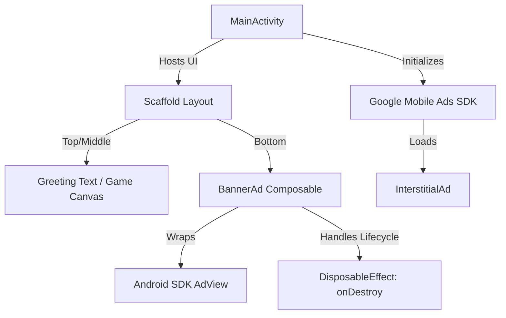

# Technical Architecture — Bubblezilla

## 1. Overview
Bubblezilla is built on a modern Android architecture featuring **Jetpack Compose** for UI presentation and Google Mobile Ads SDK for monetization. The codebase follows the Single Activity pattern.

## 2. Key Components
### 2.1. MainActivity
- **Role**: Entry point of the application (`ComponentActivity`).
- **Initialization**: Sets up Edge-to-Edge display and initializes the `MobileAds` SDK on creation.
- **Ad Preloading**: Triggers background loading of full-screen interstitial ads via `loadInterstitialAd()` and manages callback listeners.
- **Auto-Preload**: Automatically nullifies and requests a new interstitial ad when the user closes an active ad, ensuring high availability.

### 2.2. BannerAd Composable
- **Role**: Integration of legacy Android View elements into the Compose framework.
- **Implementation**: Uses `AndroidView` to wrap the classic XML-style `AdView` from the Google Play Services Ads SDK.
- **Lifecycle Safety**: Employs a `DisposableEffect` that monitors the Composable lifecycle. When `BannerAd` leaves the composition tree, it calls `adView.destroy()` to prevent memory leaks.

### 2.3. Styling & Theme System
Located under `ui/theme/`:
- `Color.kt`: Houses custom theme colors.
- `Theme.kt`: Implements the Material 3 `BubblezillaTheme` custom style provider.
- `Type.kt`: Sets up the font styling configuration.

## 3. Data & Control Flow
1. **Activity Creation**: `onCreate()` initializes ads -> loads screen layout -> loads banner ad via `AndroidView` update block -> preloads interstitial ad.
2. **Recomposition**: Layout transitions trigger Compose updates.
3. **Interstitial Trigger**: Public function `showInterstitialAd()` is exposed to allow external handlers to trigger fullscreen advertisements.
